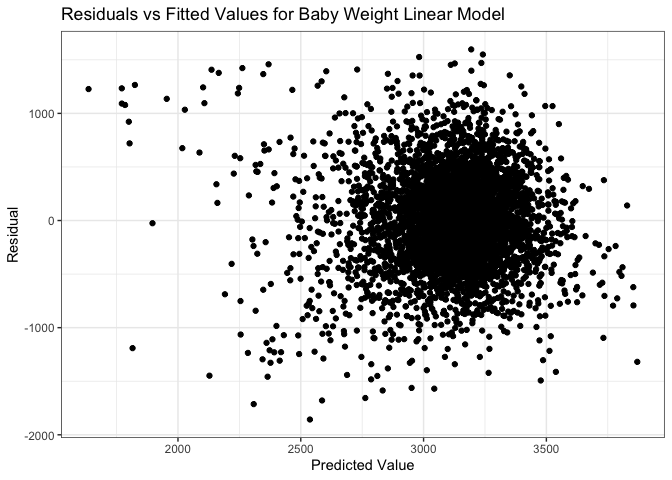
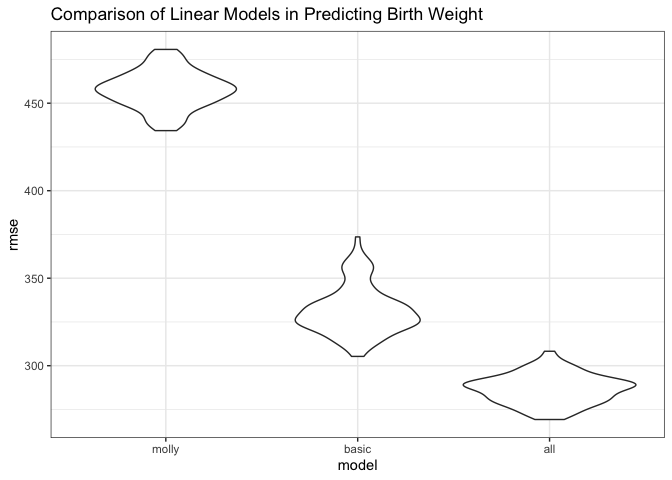

P8105: Homework 6
================
Molly Martorella
11/21/2019

# Problem 1

Load the data:

``` r
birth <- read_csv(file = "data/birthweight.csv") %>% 
  mutate(babysex = recode_factor(babysex, 
                                 '1' = "male", 
                                 '2' = "female"),
         frace = recode_factor(frace,
                               '1' = "white",
                               '2' = "black",
                               '3' = "asian",
                               '4' = "puerto_rican",
                               '8' = "other"),
         malform = recode_factor(malform, 
                                 '0' = "absent", 
                                 '1' = "present"),
         mrace = recode_factor(mrace, 
                               '1' = "white",
                               '2' = "black",
                               '3' = "asian",
                               '4' = "puerto_rican",
                               '8' = "other"))
```

    ## Parsed with column specification:
    ## cols(
    ##   .default = col_double()
    ## )

    ## See spec(...) for full column specifications.

Checked for missing data and appropriate variable types using
`skimr::skim(birth)`, which showed no missing data and numeric variables
were recoded to factors where appropriate. The dataset contains 4342
observations of 20 variables, which describe characteristics of the
mother pre and postpartum, the father, and the newborn
baby.

## Generating a linear regression model

``` r
molly_model = lm(data = birth, bwt ~ smoken + ppbmi + momage + fincome + gaweeks)

molly_model %>% 
  tidy() %>% 
  knitr::kable(digits = 3)
```

| term        | estimate | std.error | statistic | p.value |
| :---------- | -------: | --------: | --------: | ------: |
| (Intercept) |   80.563 |   100.694 |     0.800 |   0.424 |
| smoken      |  \-7.121 |     0.942 |   \-7.558 |   0.000 |
| ppbmi       |   13.064 |     2.193 |     5.957 |   0.000 |
| momage      |    7.730 |     1.910 |     4.048 |   0.000 |
| fincome     |    2.032 |     0.284 |     7.153 |   0.000 |
| gaweeks     |   64.297 |     2.224 |    28.917 |   0.000 |

The `molly_model` incorporates variables I expected to increase baby
weight (`ppbmi`, `momage` - due to risk of gestational diabetes), as
well as variables I expected to decrease baby weight (`smoken`, and
`gaweeks` to account for prematurity). I also included `fincome` to
investigate potential effects of healthcare access. The summary table
indicates all of these variables have a signficant linear relationship
with baby weight.

``` r
birth %>% 
  add_predictions(molly_model) %>% 
  add_residuals(molly_model) %>% 
  ggplot(aes(x = pred, y = resid)) + 
  geom_point() +
  theme_bw() +
  ggtitle("Residuals vs Fitted Values for Baby Weight Linear Model") +
  xlab("Predicted Value") +
  ylab("Residual")
```

<!-- -->

The plot suggests a linear relationship between the variables and baby
weight. However there is possible heteroskedasticity, as baby weight may
diverge more from predicted values at low baby weights.

## Comparison of model to provided models

Create models to predict birthweight: 1. `basic_baby` - length at birth
and GA as predictors 2. `all_baby` - head circumference, length, sex,
and all interactions

``` r
basic_baby = lm(data = birth, bwt ~ blength + gaweeks)

basic_baby %>% 
  tidy() %>% 
  knitr::kable(digits = 3)
```

| term        |   estimate | std.error | statistic | p.value |
| :---------- | ---------: | --------: | --------: | ------: |
| (Intercept) | \-4347.667 |    97.958 |  \-44.383 |       0 |
| blength     |    128.556 |     1.990 |    64.604 |       0 |
| gaweeks     |     27.047 |     1.718 |    15.744 |       0 |

The `basic_baby` model suggests both baby length and gestational age
have effects on baby weight that are
significant.

``` r
all_baby = lm(data = birth, bwt ~ bhead + blength + babysex + bhead*blength + bhead*babysex + blength*babysex + bhead*blength*babysex)

all_baby %>% 
  tidy() %>% 
  knitr::kable(digits = 3)
```

| term                        |   estimate | std.error | statistic | p.value |
| :-------------------------- | ---------: | --------: | --------: | ------: |
| (Intercept)                 | \-7176.817 |  1264.840 |   \-5.674 |   0.000 |
| bhead                       |    181.796 |    38.054 |     4.777 |   0.000 |
| blength                     |    102.127 |    26.212 |     3.896 |   0.000 |
| babysexfemale               |   6374.868 |  1677.767 |     3.800 |   0.000 |
| bhead:blength               |    \-0.554 |     0.780 |   \-0.710 |   0.478 |
| bhead:babysexfemale         |  \-198.393 |    51.092 |   \-3.883 |   0.000 |
| blength:babysexfemale       |  \-123.773 |    35.119 |   \-3.524 |   0.000 |
| bhead:blength:babysexfemale |      3.878 |     1.057 |     3.670 |   0.000 |

In the `all_baby` lm model, all variables and interactions between them
have a significant effect on final baby weight except for the
interaction between head circumference and baby length.

Now comparing `all_baby` and `basic_baby` to `molly_model` in terms of
cross-validated prediction error:

``` r
cv_df = crossv_mc(birth, 100)

cv_df =
  cv_df %>% 
  mutate(
    train = map(train, as_tibble),
    test = map(test, as_tibble))

cv_df = 
  cv_df %>% 
  mutate(molly = map(train, ~molly_model),
         basic = map(train, ~basic_baby),
         all = map(train, ~all_baby)) %>% 
  mutate(rmse_molly = map2_dbl(molly, 
                               test, 
                               ~rmse(model = .x, data = .y)),
         rmse_basic = map2_dbl(basic, 
                               test, 
                               ~rmse(model = .x, data = .y)),
         rmse_all = map2_dbl(all, 
                             test, 
                             ~rmse(model = .x, data = .y)))


cv_df %>% 
  select(starts_with("rmse")) %>% 
  pivot_longer(everything(), 
               names_to = "model", 
               values_to = "rmse", 
               names_prefix = "rmse_") %>% 
  mutate(model = fct_inorder(model)) %>% 
  ggplot(aes(x = model, y = rmse)) + 
  geom_violin() +
  theme_bw() +
  ggtitle("Comparison of Linear Models in Predicting Birth Weight")
```

<!-- -->

From the plot it is apparent that the model incorporating the most baby
traits and interaction of those traits is the best model for predicting
baby weight. The `molly_model` suffers likely because it primarily uses
characteristics of the mother to predict the weight of the baby.

# Problem 2
